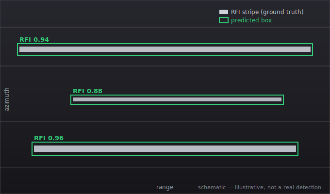
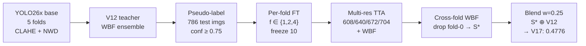

# RFI Detection in Sentinel-1 SAR Imagery

**Pseudo-label distillation + multi-resolution ensemble for Radio-Frequency Interference detection.**
Solution to the ESA **ClearSAR Track 1** Grand Challenge — *"Houston, You Copy?"* (AI4QC) — at **IEEE ICIP 2026**.

[](docs/clearsar_paper.pdf)
[](docs/clearsar_abstract_2p.pdf)
[](pyproject.toml)
[](LICENSE)

---

## TL;DR

A single-GPU pipeline for detecting RFI stripes in Sentinel-1 quicklooks. It combines a **YOLO26x** detector trained with a **pixel-space Normalised Wasserstein Distance (NWD)** loss, **pseudo-label distillation** from a multi-source ensemble teacher onto the unlabelled test set, **multi-resolution test-time augmentation (TTA)** fused with **Weighted Box Fusion (WBF)**, and a **selective cross-fold ensemble** that drops the domain-overlapping fold.

| | |
|---|---|
| **Final score** | **0.4776** mAP@[.50:.05:.95] on the held-out test set |
| **Leaderboard** | **28th of 172** entrants |
| **Compute** | one cloud NVIDIA A100, 15 fine-tuning epochs/fold |
| **Gain over per-fold baseline** | **+0.077** mAP (meta-validation ablation) |

> A reproducible writeup of a single-person entry, focused on methodology: leak-isolated evaluation, a distillation + TTA + selective-WBF recipe, and a log of what *didn't* transfer (see [Negative results](#negative-results)).

---

## The challenge

<p align="center">
  
  <br><sub><b>Schematic illustration</b> (not a real detection — the ESA dataset is license-restricted). RFI appears as thin, near-full-width horizontal stripes; the detector localises each with a bounding box.</sub>
</p>

ClearSAR Track 1 frames RFI detection as COCO-style object detection. RFI appears as thin horizontal stripes in variable-size Sentinel-1 RGB quicklooks (median ≈515×342 px):

- **median box height ≈ 10 px, width ≈ 140 px** (≈ 8:1 aspect ratio) — far from any COCO category;
- **3,154** labelled images, **786** held-out test images scored by the challenge platform from a zipped COCO-format JSON;
- metric: **mAP averaged over IoU 0.50–0.95**.

Three geometry-driven constraints shaped every design choice: IoU regression gives no gradient for non-overlapping thin boxes; SAR side-looking geometry forbids horizontal flips (−6.5 % mAP); and inference above 640 px amplifies speckle.

## Method



1. **Base detector** — YOLO26x (≈55.7 M params, no P2 head) with a CIoU + pixel-space NWD box loss (α=0.5, C=12.8 px). CLAHE contrast enhancement on the LAB L-channel; no flips.
2. **Pseudo-label distillation** — the strongest pre-distillation ensemble (V12) pseudo-labels the 786 test images (conf ≥ 0.75); per-fold students are fine-tuned on the fold-augmented data.
3. **Multi-resolution TTA** — each student is run at {608, 640, 672, 704} px and fused per-fold with WBF.
4. **Selective cross-fold fusion** — fold TTA sources are WBF-fused *dropping the domain-overlapping fold-0*, then blended with V12 at w=0.25.

Full details, equations and ablations are in the [paper](docs/clearsar_paper.pdf).

## Results

Two measurements, deliberately kept separate (this is the paper's main point — see the ICIP'26 reviewer responses below).

**(a) Construction of the student source** — on the 401-image leak-isolated meta-validation set, size/IoU-stratified (pycocotools; reproducible via `scripts/verify_ablation.py`):

| Configuration | AP | AP50 | AP75 | AP_small |
|---|---|---|---|---|
| Cold fold-0 baseline | 0.394 | 0.664 | 0.424 | 0.356 |
| Pseudo-FT student (fold 4) | 0.434 | 0.706 | 0.464 | 0.372 |
| + Multi-resolution TTA (4 res, WBF) | 0.469 | 0.746 | 0.511 | 0.411 |
| **+ 3-fold WBF (drop fold-0) = S\*** | **0.471** | **0.752** | **0.522** | **0.418** |

AP chain totals +0.077 (distillation +0.040, TTA +0.035, fold-drop +0.002). AP75 stays the weakest column — residual error is at high IoU, where sub-pixel stripe height dominates.

**(b) What actually transfers to genuinely unseen data** — official held-out test (challenge platform returns only the aggregate mAP):

| Configuration | mAP@[.50:.95] | Δ |
|---|---|---|
| Plain 5-fold WBF ensemble | 0.4720 | — |
| Teacher V12 (+RF-DETR, CLAHE swap) | 0.4755 | +0.0035 |
| **Full pipeline V17** (+distill +TTA +drop-f0 +blend) | **0.4776** | +0.0021 |

**The reading:** the meta-val chain shows the student source gaining **+0.077** in isolation, but on unseen test that source is redundant with the teacher — the entire distillation/TTA/blend stack adds only **+0.0021** over simply submitting the teacher (and **+0.0056** over a plain 5-fold ensemble). Pushing harder regresses (w=0.375 → 0.4768; a 2nd-gen pseudo-FT blend → 0.4566, below the teacher). A quality-weighted multi-fold ensemble recovers most of the attainable accuracy on fresh SAR data; the stack adds little beyond it.

### Negative results

Documented because they cost real compute and may save someone else theirs:

| Attempt | Outcome |
|---|---|
| Second architecture family (RF-DETR) | +0.0002 — saturated across 6 variants |
| D-FINE-X (DETR-family), 10-epoch fine-tune | 3×10⁻⁴ mAP — needs far more epochs |
| Inference-only SAHI, 320-px tiles | −0.085 — fragments long stripes |
| Temperature-scaled calibration | ≤ +0.0002 — teacher already calibrated |
| Horizontal-flip TTA | −6.5 % — SAR geometry is asymmetric |

## Limitations

- **Not end-to-end reproducible.** The dataset (ESA EOTDL, license-restricted), the trained weights, and the V12 teacher checkpoint are **not** included — so this repo does not regenerate 0.4776 out of the box. It is the method, code, and writeup, not a one-command reproduction.
- **Competition-grade code, not a library.** The scripts are argparse CLIs with no test suite or package structure.
- **Mid-pack leaderboard result.** 28th of 172 entrants (≈120 teams appeared on the public leaderboard); below the top entries (#1 ≈ 0.5057).

## Repository structure

```
docs/
  clearsar_paper.pdf        # 5-page technical report
  clearsar_abstract_2p.pdf  # 2-page IEEE ICIP 2026 extended abstract
  clearsar_paper.tex        # LaTeX sources (spconf.sty + IEEEbib.bst)
scripts/
  coco2yolo.py              # COCO -> YOLO label conversion
  preprocess_clahe.py       # LAB L-channel CLAHE preprocessing
  train_yolo.py             # YOLO26x trainer (NWD loss, MuSGD, CLAHE)
  nwd_loss_patch.py         # pixel-space NWD patch for ultralytics BboxLoss
  predict_test.py           # multi-resolution TTA inference
  predict_val.py            # validation-set inference
  ensemble_wbf.py           # single-stage Weighted Box Fusion
  eval_coco.py              # pycocotools mAP evaluation
  verify_ablation.py        # reproduce the meta-val ablation chain from saved preds
requirements.txt
```

## Reproduce

```bash
# environment (uv recommended)
uv venv && source .venv/bin/activate
uv pip install -r requirements.txt

# 1. preprocess quicklooks (CLAHE)
python scripts/preprocess_clahe.py --src <raw_images> --out data/yolo_clahe

# 2. train YOLO26x base with pixel-space NWD loss
python scripts/train_yolo.py --model yolo26x.pt --data data/<fold>/dataset.yaml \
    --imgsz 640 --batch 16 --epochs 120 --optimizer MuSGD --cos-lr \
    --nwd-loss --nwd-alpha 0.5 --nwd-c 12.8

# 3. multi-resolution TTA inference
python scripts/predict_test.py --weights best.pt --test-dir data/yolo_clahe/test \
    --imgsz 704 --cat-id 1 --out preds.json

# 4. fuse with WBF (iou=0.70, conf_type=max)
python scripts/ensemble_wbf.py   # see script args for source list / weights
```

Data is **not** redistributed here (ESA EOTDL licensing — challenge rule: no external data); obtain it from the official ESA ClearSAR challenge via EOTDL.

## Paper

Full method, ablations and negative results: **[`docs/clearsar_paper.pdf`](docs/clearsar_paper.pdf)**.
The 2-page IEEE ICIP 2026 Grand Challenge extended abstract: **[`docs/clearsar_abstract_2p.pdf`](docs/clearsar_abstract_2p.pdf)**.

```bibtex
@misc{elghoudane2026rfi,
  title  = {RFI Detection in Sentinel-1 SAR Imagery via Pseudo-Label
            Distillation and Multi-Resolution Ensemble},
  author = {Elghoudane, Anas},
  note   = {ESA ClearSAR Track 1 Grand Challenge, IEEE ICIP 2026},
  year   = {2026}
}
```

## Acknowledgements

ESA ClearSAR / AI4QC organisers for the challenge and dataset. Built on
[Ultralytics YOLO26](https://github.com/ultralytics/ultralytics),
[Weighted Boxes Fusion](https://github.com/ZFTurbo/Weighted-Boxes-Fusion), and
[RF-DETR](https://github.com/roboflow/rf-detr).

## License

[MIT](LICENSE) — code only. The competition dataset is governed separately by ESA EOTDL terms.
